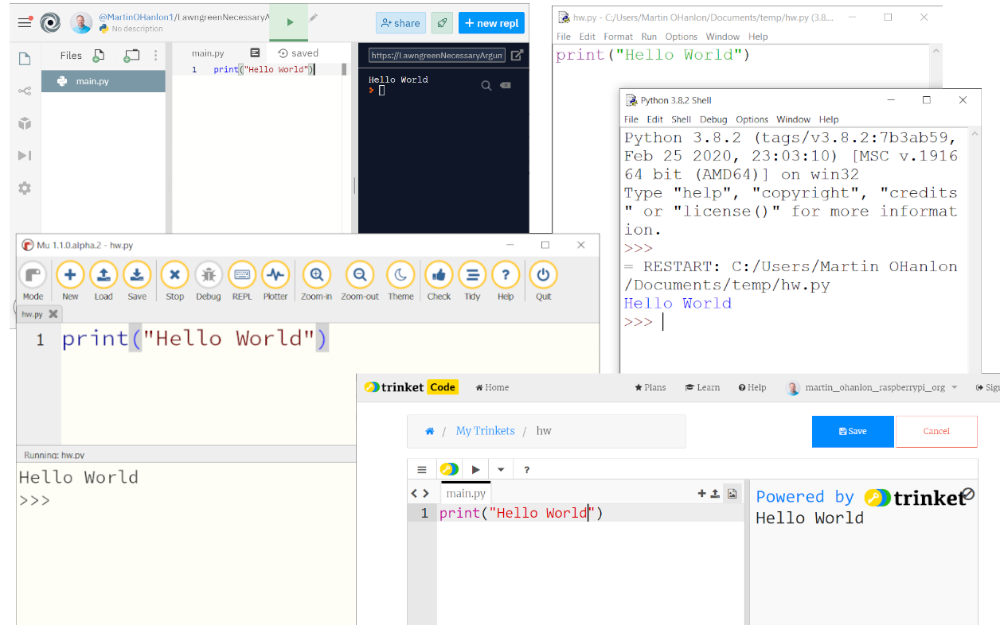

## Introduction

To create Python programs you need a text editor to write your code and a Python interpreter which takes your code and runs it.

An editor, interpreter and other useful tools (such as a file browser) are often bundled together into an Integrated Development Environment (IDE), which makes the process of creating programs much easier.

The IDE you use could be a website such as repl.it or a Python application installed on your computer.

This guide compares 3 different types of IDE and provides information to help you make a decision about what solution is best for you:

+ [Online](1) - websites where you can create and run your code in a browser
+ [Dedicated Python editor](2) - a single purpose Python IDE installed on your computer 
+ [Full Python install](3) - a full Python installation on your computer with an optional "standalone" IDE

### Comparison

|   | Online | Dedicated Python editor | Full Python install |
| - | - | - | - |
| ***Requires installation*** | No | Yes | Yes |
| ***Available offline*** | No | Yes | Yes |
| ***Useful for*** | Learners who are unable to install software | Those who don't always have access to the internet | Experts or those who wish to use advanced features |
| ***Experience level*** | Learner| Learner & Intermediate | Intermediate & Expert |
| ***Examples*** | [repl.it](https://repl.it)   [trinket.io](https://trinket.io) | [Mu](https://codewith.mu)   [Thonny](https://thonny.org) | [python.org](https://python.org)   [VS Code](https://code.visualstudio.com/)  [Atom](https://atom.io/) |
