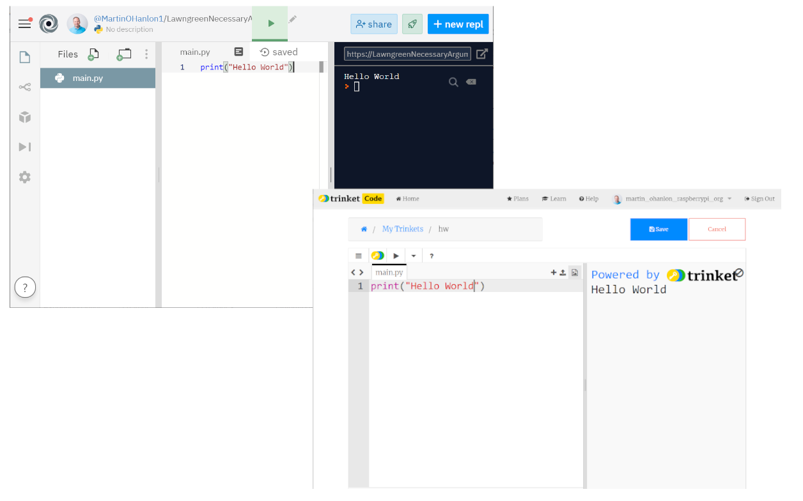
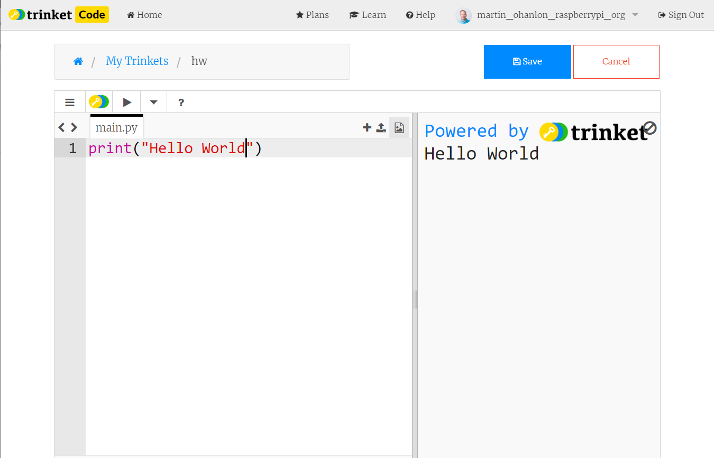

## Online
Using an online IDE you can write and run Python programs using just your web browser.

Online IDEs are a great option for those new to Python and don't require you install any additional software. 

The code is stored online and can be accessed from any internet connected device, which can be useful if you are using devices in different locations. They often have in-built features for sharing programs with others. 

Online IDEs often work across computers, tablets and phones. While it is possible to create Python programs on a mobile device, the small screen size can make this difficult.

While the majority of new learners requirements are supported, not all Python libraries will be supported, particularly those which require a graphical user interface or use 3rd party services. 

**Advantages**

+ Simple to get started.
+ No need to install additional software
+ Support the "majority" of new learners requirements
+ In-built features for sharing code with others
+ The code can be accessed by any internet connected device

**Disadvantages**

+ Connection to the internet is required.
+ Limited support for additional packages and libraries.
+ Not all features will be available

*Online IDEs are useful for those who cannot install software on their computer or want to program across many devices (laptop, tablet, phone, etc).*

**Example Online IDEs**

[repl.it](https://repl.it)

[Repl.it Quick Start Guide](https://docs.repl.it/misc/quick-start)

[trinket.io](https://trinket.io)

[Trinket Getting Started Guide](https://trinket.io/help#getting-started)
