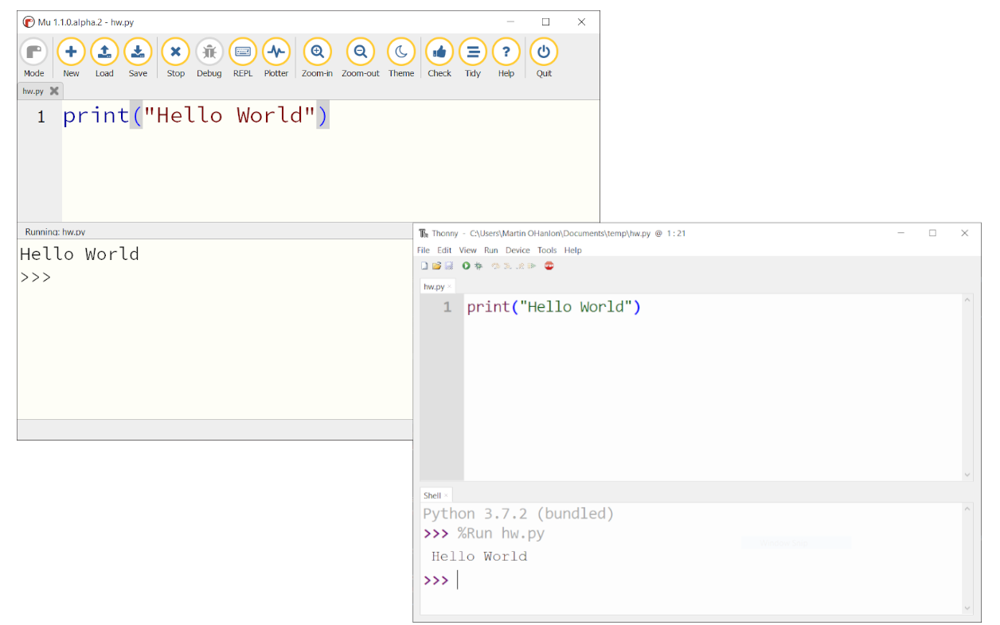
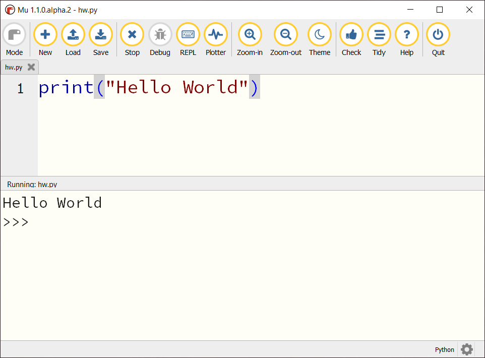
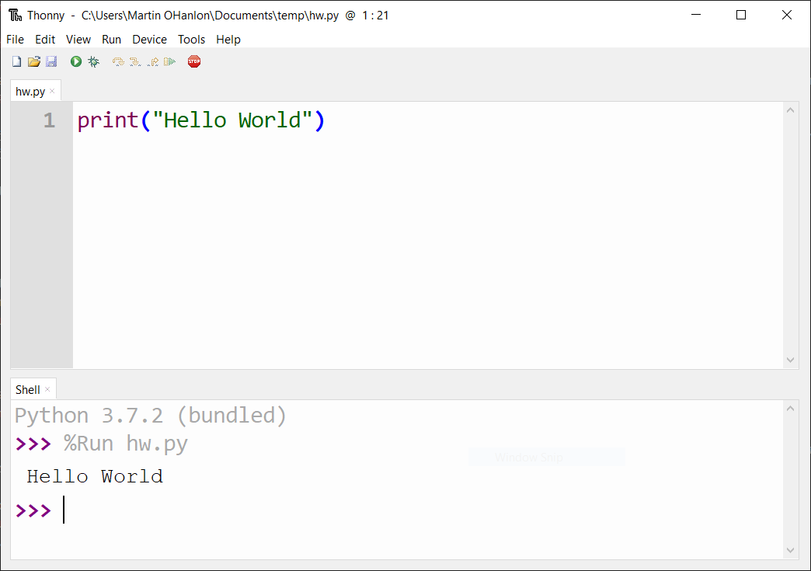

## Dedicated Python editor

A dedicated Python editor is a single application with a simple interface where you can write, debug, and run your programs. 

This single application comprises Python itself, the IDE, and other required software, and it needs to be installed on your computer (Windows, macOS, Linux, Raspberry Pi OS, etc.).

Dedicated Python editors normally include support for checking and debugging code as well as features that help you install additional packages.

Programs typically run faster in a dedicated editor than in an online IDE. And you can use an installed Python editor whether you are online or offline.

While dedicated editors fulfil the majority of programmers' requirements, some advanced features may not be available.

### Advantages

+ Simple user interface
+ Fulfils most programmers' needs
+ Increased performance compared to online IDEs
+ Support for debugging tools and package installation

### Disadvantages

+ Some advanced features may not be available
+ Your code can only be accessed on this device

### Conclusion

Dedicated Python editors are useful for programmers who can install software on their computer, want a simple but powerful interface, and don't require advanced features.

**Examples of dedicated Python editors**

[Mu](https://codewith.mu)

[Download Mu](https://codewith.mu/en/download)
[Mu how-to guides](https://codewith.mu/en/howto/)
[Mu tutorials](https://codewith.mu/en/tutorials/)

[Thonny](thonny.org)

[Download Thonny](https://thonny.org/)
[Thonny wiki](https://github.com/thonny/thonny/wiki)
