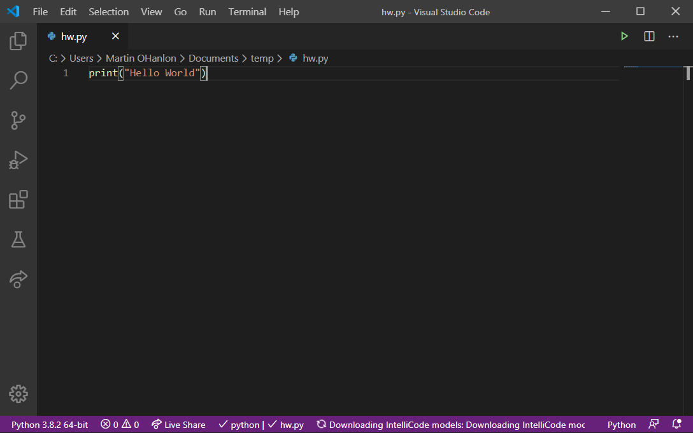
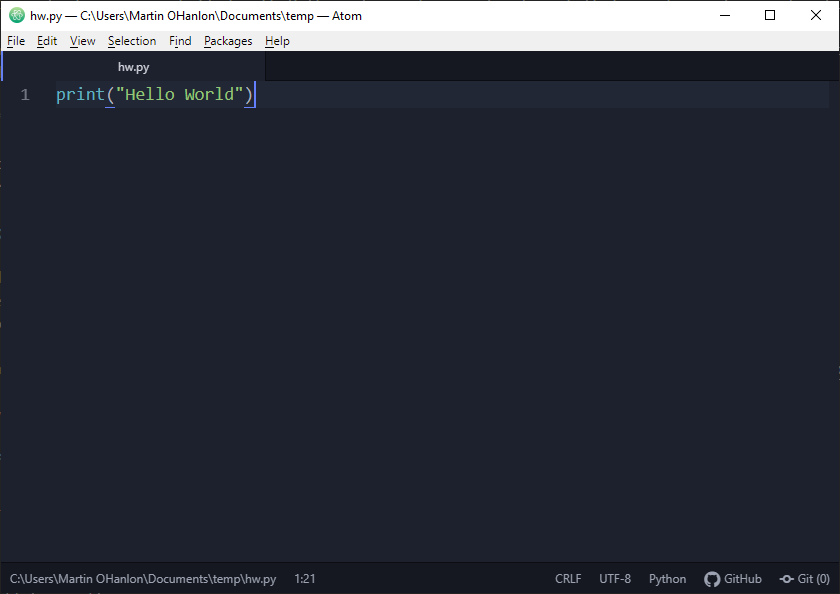

## Full Python install

When you implement a full installation of Python, you have the option to use an additional IDE to write your Python programs. These IDEs come with advanced features for managing source code, debugging, and coding in various programming languages.

Installing Python on your computer means it will support all Python features, and a stand-alone IDE is highly flexible and you can set it up to support all your use cases. 

One example of such an IDE is the IDLE editor. This IDE gets installed automatically when you install Python on your computer, and it has a two-window layout that can be confusing (particularly for people who are new to Python).

The setup of a stand-alone IDE is more complicated than that of a dedicated Python IDE, and the IDE may require additional configuration to cater for your needs.

**Advantages**

+ Highly flexible
+ Supports all Python features

**Disadvantages**

+ The IDLE editor automatically installed with Python can be confusing for new learners
+ More complex to set up: using an additional IDE requires extra installation and configuration
+ The additional functions and features can be very confusing

### Conclusion

A full installation of Python and an additional stand-alone IDE is the right setup for advanced users and people who want to explore advanced features or libraries.

The full Python installation can be downloaded from [python.org/downloads](https://www.python.org/downloads/).

[[[generic-python-install-python3]]]

**Examples of IDEs for use with Python**

* [Visual Studio Code](https://code.visualstudio.com)

* [Atom](https://atom.io/)

